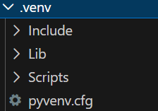
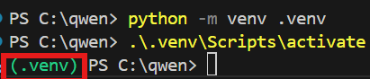
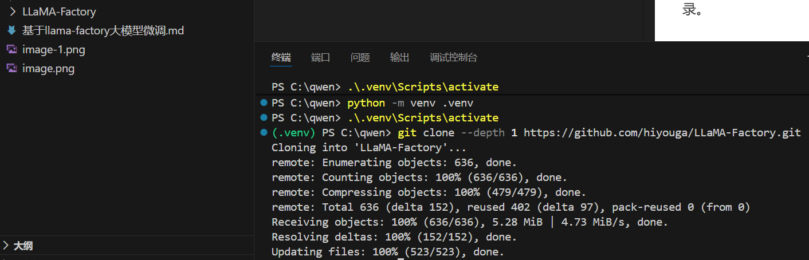
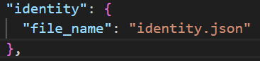
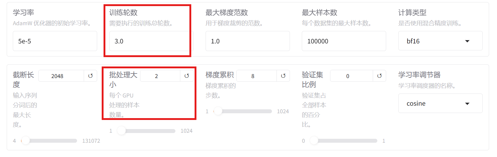
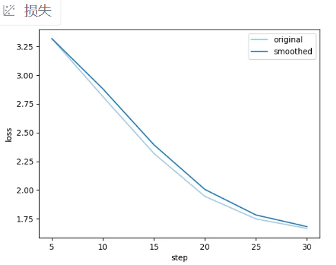
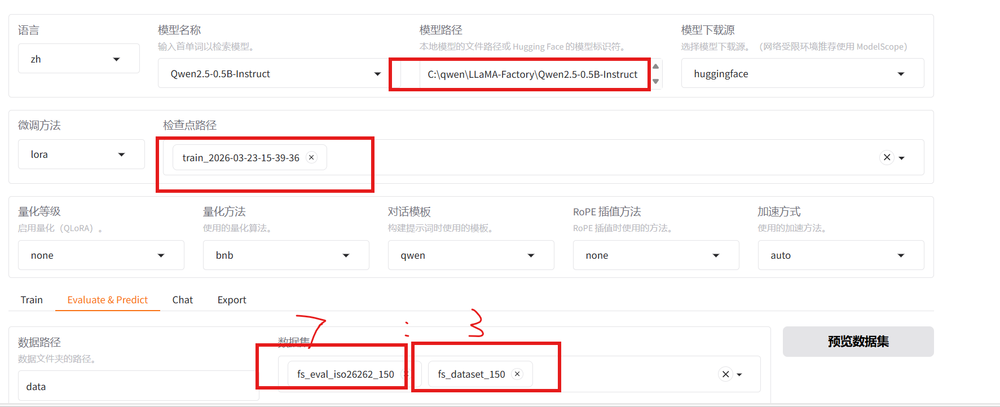

项目文档地址：https://github.com/hiyouga/LlamaFactory
# 搭建环境
## 1.创建+激活虚拟环境
```
python3.11 -m venv venv_name
```
venv_name是虚拟环境的名字，一般命名为.venv
python3.11是python的版本
在创建过程中千万不要点击键盘，容易导致虚拟环境创建被打断，即创建不完整

(**由于conda被禁止，那么用venv只能使用系统下载的python版本，不能在虚拟环境中选择版本**)
>如果你创建不完整/创建失败，想要删除此环境，则：
```
Remove-Item -Recurse -Force .\.venv
```
激活虚拟环境：
```
.\.venv\Scripts\activate
```
这个.venv是你刚自己写的虚拟环境的名字。


安装pytorch：
```
pip install torch torchvision torchaudio --index-url https://download.pytorch.org/whl/cpu
```
依然是cpu-only。
不过上面这个会受到SSL的拦截，不能使用。
要去：<https://download.pytorch.org/whl/torch_stable.html>找cpu/torch-2.2.0%2Bcpu-cp311-cp311-win_amd64.whl下载到本地（cp311的311是python版本）
在venv环境中运行：
```
pip install C:\qwen\torch-2.2.0+cpu-cp311-cp311-win_amd64.whl
```
(**一般来说，用GPU做后续量化微调的话，需要配置环境，但是我们这边用的是cpu only**)
## 2.拉取llama-factory代码
```
git clone --depth 1 https://github.com/hiyouga/LLaMA-Factory.git
```
这条命令会把 LLaMA-Factory 仓库以最小深度( 只下载每个文件最近的一次提交（最新版）)克隆到当前目录。

然后进入此文件：
```
cd LLaMA-Factory
```
(**b必须进入此文件目录，才能执行后续操作（不然CLI无法配置）**)
配置CLI：
```
pip install -e ".[torch,metrics]"
```
如果不执行它：
- 没有 llamafactory-cli
- 无法训练模型
- 无法启动 WebUI
- 项目代码无法正常 import

## 3.下载模型
1. 手动下载模型
   步骤 1：比如我们就用huggingface去手动下载，先进入huggingface官网：
   <https://huggingface.co/models>
   挑选你想用的模型，我们这边用的是<https://huggingface.co/Qwen/Qwen2.5-0.5B-Instruct>
   步骤 2：点击 “Files and versions”里面可以看到所有模型文件：
```
config.json
tokenizer.json
pytorch_model.bin / safetensors
model.safetensors.index.json
generation_config.json
special_tokens_map.json
```

   步骤 3：逐个文件用浏览器点击下载
   下载后放到一起即可：
    ```
C:\qwen\models\YOUR_MODEL_NAME\
    - config.json
    - tokenizer.json
    - model.safetensors
    - generation_config.json
    ```
或者你用git也行(**这个比较方便**)：
```
git clone https://huggingface.co/Qwen/Qwen2.5-0.5B-Instruct
```
2. 代码下载模型
### 4.启动llama-factory的webui
先测试功能是否正常，，输入以下命令获取训练相关的参数指导, 否则说明库还没有安装成功。
```
llamafactory-cli train -h
```
启动webui：
```
llamafactory-cli webui
```


# 微调数据集
## 1.概念知识
sft微调（监督微调）一般用alpaca格式，dpo优化（偏好优化）的偏好数据一般用sharegpt 格式。
>**DPO（直接偏好优化）和SFT（监督微调）** 是机器学习中的两种优化方法：
DPO：通过使用人类偏好数据来训练模型，使其输出更符合人类的喜好。它直接利用偏好数据进行优化，计算偏好输出和非偏好输出之间的比率，并使用 sigmoid 函数进行优化。 
SFT：在预训练模型的基础上，通过标注数据（通常是构造的对话数据）进一步优化模型性能。SFT 主要关注于特定任务的微调，以提高模型的对话能力。 

微调用alpaca格式：
数据通常以 JSON 格式存储，每个样本包含以下几个核心字段：
instruction（指令）：告诉模型要做什么。
input（输入，可选）：提供给模型的具体上下文或问题。
output（输出）：模型应该生成的回答。

作用：
让模型学会按照人类给出的明确指令完成任务。
适合单轮对话场景，比如问答、翻译、总结等。
数据结构简单，便于准备和处理。
举例：
```json
{
  "instruction": "将以下句子翻译成英文",
  "input": "今天天气很好。",
  "output": "The weather is nice today."
}
```
 **目的：让模型模仿你的“写法、语气、人物风格”**
==**一、利用 Easy Dataset 构建高质量微调数据集**==
## 2.数据导入llama-factory
在C:\qwen\LLaMA-Factory\data目录下找到C:\qwen\LLaMA-Factory\data\dataset_info.json文件。
把你自己的数据集放到data目录下，然后进入dataset_info.json，模仿如下，写自己的：

格式：
```python
 "你的数据集的名字": {
    "file_name": "你的数据集.json"
  },
```
然后保存。即可在webui界面找到对应数据集：

# 开始微调

可能会提示没有接收到cuda环境（用的cpu，很正常）
微调完的输出的保存路径：#lora的保存路径在llama-factory根目录下，如`saves\Qwen2-7B-int4-Chat\lora\train_2024-
07-17-15-56-58\checkpoint-500`
在模型微调中，LOSS（损失函数）是一个可微的数学函数，它量化了模型预测结果与真实目标值之间的误差（输出为一个标量数值）。用loss图体现


# 训练的代码分析
```
llamafactory-cli train `                     # 启动 LLaMA‑Factory 的训练流程
    --stage sft `                            # 训练阶段为 SFT（监督微调）
    --do_train True `                        # 启用训练模式
    --model_name_or_path C:\qwen\LLaMA-Factory\Qwen2.5-0.5B-Instruct `  # 基础模型路径
    --preprocessing_num_workers 16 `         # 数据预处理线程数（CPU 多线程）
    --finetuning_type lora `                 # 使用 LoRA 微调
    --template qwen `                        # 使用 Qwen 对话模板
    --flash_attn auto `                      # 自动启用 FlashAttention（显存更省）
    --dataset_dir data `                     # 数据集目录
    --dataset fs_dataset_150 `               # 使用的数据集名称
    --cutoff_len 2048 `                      # 每条数据最大 token 长度（超出截断）
    --learning_rate 5e-05 `                  # 学习率
    --num_train_epochs 3.0 `                 # 训练 3 个 epoch
    --max_samples 100000 `                   # 数据采样上限（大于则随机选 100k 条）
    --per_device_train_batch_size 2 `        # 每张 GPU 的 batch size = 2
    --gradient_accumulation_steps 8 `        # 梯度累积 8 次，相当于总 batch = 16
    --lr_scheduler_type cosine `             # 余弦学习率衰减策略
    --max_grad_norm 1.0 `                    # 梯度裁剪阈值，防止梯度爆炸
    --logging_steps 5 `                      # 每 5 step 打印一次日志
    --save_steps 100 `                       # 每 100 step 保存一次模型
    --warmup_steps 0 `                       # 不使用 warmup
    --packing False `                        # 不对样本进行 packing
    --enable_thinking True `                 # 启用“thinking”模式（模型内部思考链）
    --report_to none `                       # 不将日志汇报到 wandb 或 tensorboard
    --output_dir saves\Qwen2.5-0.5B-Instruct\lora\train_2026-03-23-15-39-36 `   # 输出目录
    --fp16 True `                            # 使用 FP16 训练（省显存）
    --plot_loss True `                       # 训练完成后自动绘制 loss 曲线
    --trust_remote_code True `               # 允许加载模型附带的自定义代码
    --ddp_timeout 180000000 `                # DDP 训练超时设置为极大值，防止卡死
    --include_num_input_tokens_seen True `   # 日志记录训练耗费的 token 数
    --optim adamw_torch `                    # 使用 AdamW (Torch) 优化器

    --lora_rank 8 `                          # LoRA rank = 8（常见、省参）
    --lora_alpha 16 `                        # LoRA scaling α 参数
    --lora_dropout 0 `                       # LoRA dropout 关闭（通常 SFT 用不到）
    --lora_target all                        # 对全部可训练模块应用 LoRA
```
# 模型评估
训练的时候，就划分了训练集、验证集、测试集，6:3:1.
验证集用于观察有没有过拟合，一般来说是loss；测试集是在训练完成后测试模型的能力，可以自己设置各种指标。
一个好的微调，尽量是在具备垂直领域知识的同时，也保留了原始的通用能力。
## 1.0-shot和5-shot评测
- 0-shot 是指在进行评测时，模型没有访问任何示例输入和输出，需要完全依靠自己的知识和能力来生成输出。
- 5-shot 是指在进行评测时，模型可以访问 5 个示例输入和相应的输出，以帮助模型更好地理解任务并生成更准确的输出。
  
## 通用知识测评
CMMLU（中文大模型基准）:
名称: Chinese Massive Multitask Language Understanding。
语言: 主要评估模型在中文任务上的表现。
任务数量: 继承了MMLU的多任务评估框架，但是针对中文领域和文化进行了扩展和调整。
测试目标: 类似于MMLU，但其任务和测试数据更贴近中文应用场景和文化背景，从而更适合评估中文语言模型的能力。
1.用0-shot：
```python
export CUDA_VISIBLE_DEVICES=""
llamafactory-cli eval
  --model_name_or_path C:/qwen/LLaMA-Factory/Qwen2.5-0.5B-Instruct 
  --template qwen2 
  --task cmmlu_engineering 
  --lang zh 
  --n_shot 0 
  --batch_size 1
```

## 微调效果测评
**测评指标：**
BLEU-4： BLEU（Bilingual Evaluation Understudy）是一种常用的机器翻译质量评估指标。BLEU-4 表示四元语法 BLEU 分数，衡量模型生成文本与参考文本之间的 N-gram 匹配程度，其中 N=4。值越高表示生成的文本与参考文本越相似，最大值为 100。
ROUGE-1/ROUGE-2： ROUGE（Recall-Oriented Understudy for Gisting Evaluation）用于评估自动摘要和文本生成模型性能。ROUGE-1 表示一元 ROUGE 分数，ROUGE-2 表示二元 ROUGE 分数，分别衡量模型生成文本与参考文本之间的单个词和双词序列的匹配程度。值越高表示生成的文本与参考文本越相似，最大值为 100。
ROUGE-L： ROUGE-L 衡量模型生成文本与参考文本之间最长公共子序列（Longest Common Subsequence）的匹配程度。值越高表示生
然后使用自动化的bleu和 rouge等常用的文本生成指标来做评估。指标计算会使用如下3个库，请先做一下pip安装.
```
pip install jieba  
pip install rouge-chinese  
pip install nltk
```
为了评估的准确性，通常会将数据集划分为训练集、验证集和测试集。在LLaMA-Factory中，用户可以根据具体需求调整划分比例，但一般建议按照60%-20%-20%的比例进行划分。（我用的是7：3——训练和验证）

代码如下：
```
llamafactory-cli train `
    --stage sft `
    --model_name_or_path C:\qwen\LLaMA-Factory\Qwen2.5-0.5B-Instruct `
    --preprocessing_num_workers 16 `
    --finetuning_type lora `
    --quantization_method bnb `
    --template qwen `
    --flash_attn auto `
    --dataset_dir data `
    --eval_dataset fs_eval_iso26262_500,fs_dataset_150 `
    --cutoff_len 1024 `
    --max_samples 100000 `
    --per_device_eval_batch_size 2 `
    --predict_with_generate True `
    --report_to none `
    --max_new_tokens 512 `
    --top_p 0.7 `
    --temperature 0.95 `
    --output_dir saves\Qwen2.5-0.5B-Instruct\lora\eval_2026-03-24-11-06-20 `
    --trust_remote_code True `
    --ddp_timeout 180000000 `
    --do_predict True `
    --adapter_name_or_path saves\Qwen2.5-0.5B-Instruct\lora\train_2026-03-23-15-39-36
```